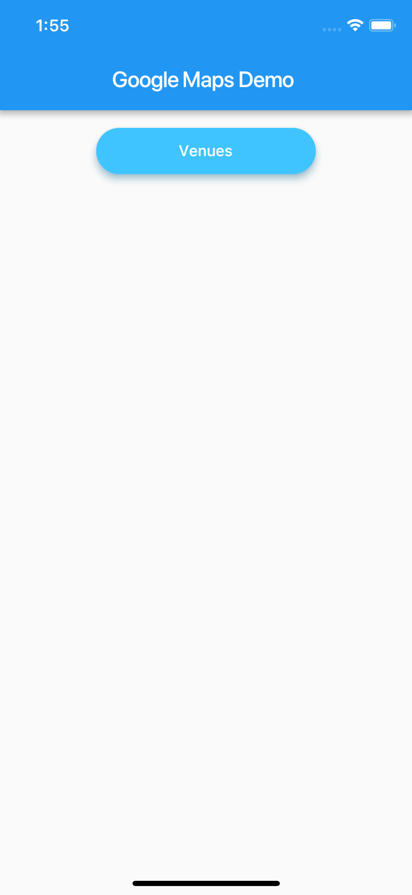
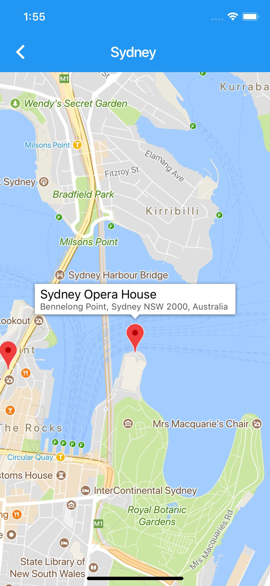
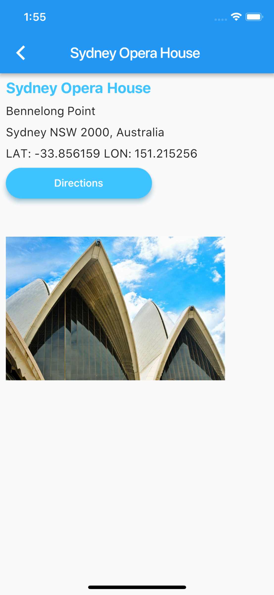
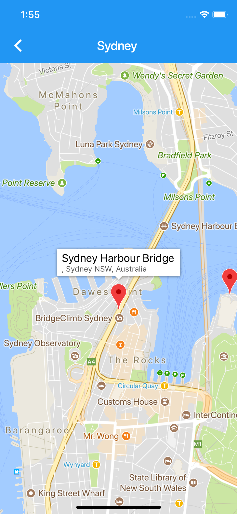
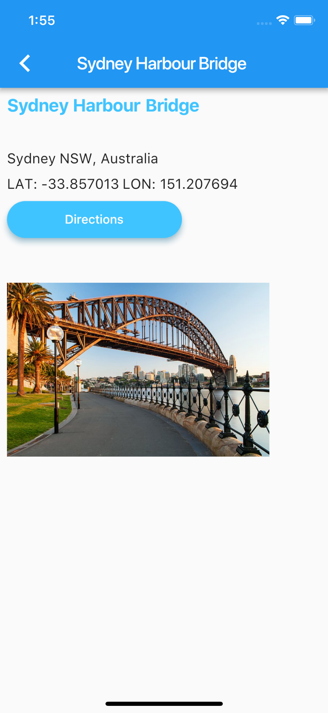

# maps_demo

A Flutter example to use [Google Maps](https://developers.google.com/maps/) in
iOS and Android apps via the embedded Google Maps plugin [Google Maps Plugin](https://github.com/flutter/plugins/tree/master/packages/google_maps_flutter) 

## Getting Started

Get an API key at <https://cloud.google.com/maps-platform/>.

### Android

Specify your API key in the application manifest `android/app/src/main/AndroidManifest.xml`:

```xml
<manifest ...
  <application ...
    <meta-data android:name="com.google.android.geo.API_KEY"
               android:value="YOUR KEY HERE"/>
```

### iOS

Supply your API key in the application delegate `ios/Runner/AppDelegate.m`:

```objectivec
#include "AppDelegate.h"
#include "GeneratedPluginRegistrant.h"
#import "GoogleMaps/GoogleMaps.h"

@implementation AppDelegate

- (BOOL)application:(UIApplication *)application
    didFinishLaunchingWithOptions:(NSDictionary *)launchOptions {
  [GMSServices provideAPIKey:@"YOUR KEY HERE"];
  [GeneratedPluginRegistrant registerWithRegistry:self];
  return [super application:application didFinishLaunchingWithOptions:launchOptions];
}
@end
```

See screenshots below:<br><br>

<br><br>


<br><br>

<br><br>

<br><br>

